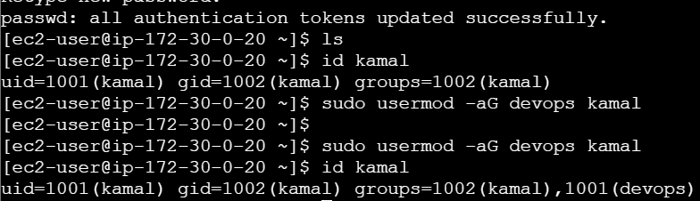

# :penguin: Linux Server Automation

## :rocket:Foundational skills 

```
│
├── Level-1-Basic-Foundational/
│   ├── ✔️ Set up users & groups for dev team
│   ├── ✔️ Manage permissions for project directories
│   ├── ✔️ Install required packages (git, nginx, java)
│   └── ✔️ Check system info (memory, CPU, disks)
│
├── Level-2-Intermediate-Daily-Tasks/
│   ├── ✔️ Automate backups using Cron
│   ├── ✔️ Create shell scripts (log cleanup, restart services, health checks)
│   ├── ✔️ Manage logs under /var/log
│   └── ✔️ Monitor system performance & troubleshoot services
│
└── Level-3-Advanced-Production/
    ├── ✔️ Create custom systemd service for your application
    ├── ✔️ SSH hardening for security
    ├── ✔️ LVM setup for storage scaling
    ├── ✔️ Configure firewall rules
    └── ✔️ Implement logrotate for application logs
```

### 🔥 Setup Users & Groups for Dev Team

* Create a group  
```
sudo groupadd devops
```

* Create a user  
```
sudo useradd -m -s /bin/bash kamal
```


* set password
```
sudo passwd kamal
```
* Add user to group 
```
sudo usermod -a g   devops kamal 
```

* Verify 
```
id kamal
```


### :fire: Manage Permissions for Project Directories

* Create project directory
```
sudo mkdir -p /opt/project
```
* Change ownership
```
sudo chown -R kamal:devops /opt/project
```
* Set permissions 
```
sudo chmod -R 770 /opt/project
```
* Verify
```
ls -ld /opt/project
```


### :fire: Install Required Packages (Git, Nginx, Java)

* Update system
``` 
 sudo apt update -y         # Ubuntu
sudo yum update -y         # Amazon Linux / RHEL
```

* Install Git 
``` 
sudo apt install git -y
# OR
sudo yum install git -y
```


* Install Nginx 
```
 sudo apt install nginx -y
# OR
sudo amazon-linux-extras install nginx1
```


* Start & enable Nginx 
```
sudo systemctl start nginx1
sudo systemctl enable nginx1
```


* Install Java 
```
sudo apt install java-17-amazon-corretto -y  # Ubuntu (if repo configured)
sudo yum install java-17-amazon-corretto -y  # Amazon Linux
```

* Verify versions 
```
git --version
nginx -v
java -version
```


### :fire: Check System Information

* Memory Usage
```
free -m
```
* CPU Details 
``` 
lscpu
```
* Disk Usage 
```
df -h
```
* Running processes
```
top
```
* top
```
ip a
```

# Level 2 – Intermediate (Daily DevOps Tasks)

### :fire: Automate backups with Cron

* Schedule Cron Job
```
crontab -e
```
* Add this line to run backup every day at 2 AM
```
0 2 * * * /opt/backup.sh >> /var/log/backup.log 2>&1
```

```
Cron schedule explanation
| Field | Meaning      |
| ----- | ------------ |
| 0     | minute       |
| 2     | hour         |
| *     | day of month |
| *     | month        |
| *     | day of week  |
```

:rocket:  Runs daily at 02:00 AM

* verify corn job
Check cron list
crontab -l

Check backup log
```
cat /var/log/backup.log
```
Check backup files
```
ls -lh /opt/backups
```

## :fire: Create shell scripts: Log cleanup, service restart, health checks

:rocket: Log Cleanup Script

* Log Cleanup Script

Automatically delete logs older than 7 days.

* Create script
```
sudo nano /opt/log_cleanup.sh
```
paste  this 
```
#!/bin/bash

LOG_DIR="/var/log"
DAYS=7

echo "Deleting log files older than $DAYS days from $LOG_DIR..."

find $LOG_DIR -type f -mtime +$DAYS -exec rm -f {} \;

echo "Cleanup complete!"
```
Make executable
```
sudo chmod +x /opt/log_cleanup.sh
```
Optional: Schedule with cron (daily 1 AM)
```
0 1 * * * /opt/log_cleanup.sh >> /var/log/cleanup.log 2>&1
```

### :fire: Service Restart Script

Restart and check a service (example: nginx).

Create script
```
sudo nano /opt/restart_service.sh
```
paste this 
```
#!/bin/bash

SERVICE="nginx"

echo "Restarting $SERVICE service..."
sudo systemctl restart $SERVICE

sleep 2

STATUS=$(systemctl is-active $SERVICE)

if [ "$STATUS" = "active" ]; then
    echo "$SERVICE restarted successfully!"
else
    echo "ERROR: $SERVICE failed to restart!"
    exit 1
fi
```

Make executable
```
sudo chmod +x /opt/restart_service.sh
```

Optional: Restart service every night 3 AM
```
0 3 * * * /opt/restart_service.sh >> /var/log/service-restart.log 2>&1
```
## :fire: 3. Health Check Script

Checks CPU, Memory, Disk, and a Service.

* Create script
```
sudo nano /opt/health_check.sh
```
add
```
#!/bin/bash

SERVICE="nginx"

echo "===== SYSTEM HEALTH CHECK ====="
echo "DATE: $(date)"

echo -e "\n--- CPU Load ---"
uptime

echo -e "\n--- Memory Usage ---"
free -m

echo -e "\n--- Disk Usage ---"
df -h

echo -e "\n--- Service Status: $SERVICE ---"
systemctl is-active $SERVICE

echo "==============================="
```

Make executable
```
sudo chmod +x /opt/health_check.sh
```

Optional: Run health check every 30 mins
```
*/30 * * * * /opt/health_check.sh >> /var/log/health.log 2>&1
```

### :fire: Monitor System Performance
➤ Check real-time CPU, RAM usage
```
top
```

➤ Better visual monitoring
```
htop   # (install: sudo apt install htop -y)
```

➤ Check CPU details
```
lscpu
```
➤ Check disk usage
```
df -h
```
➤ Check memory usage
```
free -m
```
➤ Check I/O performance
```
iostat   # (install: sudo apt install sysstat -y)
```

➤ Check running processes
```
ps aux --sort=-%cpu | head
```

➤ Check network usage
```
ss -tulpn
```

➤ Check system load average
```
uptime
```

### Troubleshoot Linux Services


➤ Check service status
```
sudo systemctl status nginx
```

➤ Start service
```
sudo systemctl start nginx
```
➤ Stop service
```
sudo systemctl stop nginx
```
➤ Restart service
```
sudo systemctl restart nginx
```

### Quick Troubleshooting Flow

Check service status
```
systemctl status <service>
```

Check real-time logs
```
journalctl -u <service> -f
```

Test port
```
ss -tulpn | grep <port>
```

Validate configuration
```
nginx -t  # Or service-specific test
```

Restart
```
systemctl restart <service>
```

Check firewall
```
ufw status
``` 

# :fire: Level 3 – Advanced (Production-Ready Linux Admin)

## :rocket:  Create custom systemd service for your application 

### :fire:  Create Your Application Script
Create a script to start your application
```
sudo nano /opt/myapp/start.sh
```

Paste:
```
#!/bin/bash
echo "Application started..."
sleep infinity


(Replace with your actual application start command)
```
➤ Make it executable
```
sudo chmod +x /opt/myapp/start.sh
```
--------------------------------------------
 2. Create systemd Service File

➤ Create service file
```
sudo nano /etc/systemd/system/myapp.service
```

Paste this:
```
[Unit]
Description=My Custom Application Service
After=network.target

[Service]
Type=simple
User=root
ExecStart=/opt/myapp/start.sh
Restart=on-failure
RestartSec=5

[Install]
WantedBy=multi-user.target
```
--------------------------------------------

 3. Reload systemd to Register Service
 ```
sudo systemctl daemon-reload
```
--------------------------------------------
 4. Start the Service
 ```
sudo systemctl start myapp
```
--------------------------------------------
 5. Enable Service on Boot
 ```
sudo systemctl enable myapp
```
--------------------------------------------
 6. Check Service Status
 ```
sudo systemctl status myapp
```
--------------------------------------------
 7. View Service Logs
 ```
sudo journalctl -u myapp -f
```
--------------------------------------------
 8. Stop / Restart the Service
 ```
➤ Stop
sudo systemctl stop myapp
```
➤ Restart
```
sudo systemctl restart myapp
```
--------------------------------------------
 9. Troubleshooting

➤ Check syntax of service file
```
sudo systemd-analyze verify /etc/systemd/system/myapp.service
```
➤ Re-check logs
```
sudo journalctl -u myapp --no-pager | tail -20
```
➤ Ensure permissions are correct
```
sudo chmod +x /opt/myapp/start.sh
```
➤ If service doesn’t start after changes
```
sudo systemctl daemon-reload
sudo systemctl restart myapp
```

## :fire: SSH hardening for security

:rocket: Change Default SSH Port

Edit SSH config 
```
sudo nano /etc/ssh/sshd_config
```

Find this line:
```
#Port 22
```

Change to something like:
```
Port 2222
```
➤ Restart SSH
```
sudo systemctl restart sshd
```
Important:
```
Also allow the new port in the firewall.

For UFW (Ubuntu):

sudo ufw allow 2222/tcp


For firewalld (RHEL/CentOS):
```
sudo firewall-cmd --add-port=2222/tcp --permanent
sudo firewall-cmd --reload
```

Disable Root Login
```
Edit SSH config:

sudo nano /etc/ssh/sshd_config
```

Find:
```
PermitRootLogin yes
```

Change to:
```
PermitRootLogin no
```

Restart SSH:
```
sudo systemctl restart sshd
```
## Disable Password Authentication (Enable Key-Based Login Only) 

Edit SSH config
```
sudo nano /etc/ssh/sshd_config
```

Set:
```
PasswordAuthentication no
ChallengeResponseAuthentication no
UsePAM yes
```

This forces users to login only with SSH keys, not passwords.

➤ Restart SSH
```
sudo systemctl restart sshd
```

Limit SSH Access to Specific Users

In /etc/ssh/sshd_config add:

AllowUsers kamal devuser


Restart:
```
sudo systemctl restart sshd
```

. Verify SSH Security Status

➤ Check open ports:
```
sudo ss -tulpn | grep ssh
```

➤ Check logs:
```
sudo tail -f /var/log/auth.log


# :fire: LVM Setup for Storage Scaling

List Disks
lsblk

. Create Physical Volume (PV)
```
pvcreate /dev/xvdb
```
Check PVs
```
pvs
```
 Create Volume Group (VG)
 ```
vgcreate vg_data /dev/xvdb
```
Check VGs
```
vgs
```
. Create Logical Volume (LV)
```
lvcreate -L 10G -n lv_data vg_data
```

Check LVs
```
lvs
```
 Format the LV

```
EXT4:

mkfs.ext4 /dev/vg_data/lv_data
```

XFS:
```
mkfs.xfs /dev/vg_data/lv_data
```
. Mount the LV
```
mkdir /mnt/data
mount /dev/vg_data/lv_data /mnt/data
```

### :fire: Configure Firewall Rules

Start & Enable firewalld
```
sudo systemctl start firewalld
sudo systemctl enable firewalld
```
🔹 Allow Services
➤ Allow SSH
```
sudo firewall-cmd --add-service=ssh --permanent
```
➤ Allow HTTP & HTTPS
```
sudo firewall-cmd --add-service=http --permanent
sudo firewall-cmd --add-service=https --permanent
```
🔹 Allow Ports
➤ Allow custom port (example: 8080)
```
sudo firewall-cmd --add-port=8080/tcp --permanent
```
➤ Block port
```
sudo firewall-cmd --remove-port=21/tcp --permanent
```
🔹 Reload the Firewall
```
sudo firewall-cmd --reload
```

# :fire: Implement logrotate for app logs

:rocket: Create logrotate configuration

Create a custom logrotate file:
```

sudo nano /etc/logrotate.d/myapp
```

Paste the following:
```
/opt/myapp/logs/*.log {
    daily
    rotate 7
    compress
    delaycompress
    missingok
    notifempty
    copytruncate
    dateext
    dateformat -%Y-%m-%d
}
```

Test logrotate configuration

Run:
```
sudo logrotate -d /etc/logrotate.d/myapp
```

This is a dry-run (no changes).
If no errors → rotation works.

Force log rotation manually (for testing)
```
sudo logrotate -f /etc/logrotate.d/myapp
```

Check rotated logs:
```
ls -l /opt/myapp/logs/
```

You should see:
```
app.log-2025-12-01.gz
app.log-2025-12-02.gz
...
```

## 📌 Quick Summary

| Task                    | Command                  |
| ----------------------- | ------------------------ |
| Create logrotate config | `/etc/logrotate.d/myapp` |
| Test config             | `logrotate -d`           |
| Force rotate            | `logrotate -f`           |
| Check rotated logs      | `ls -l /opt/myapp/logs/` |
