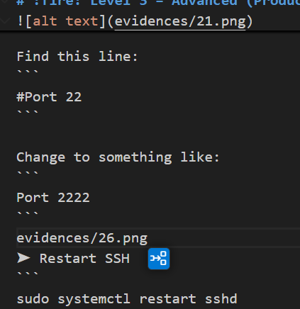

# :penguin: Linux Server Automation

## :rocket:Foundational skills 

```
│
├── Level-1-Basic-Foundational/
│   ├── ✔️ Set up users & groups for dev team
│   ├── ✔️ Manage permissions for project directories
│   ├── ✔️ Install required packages (git, nginx, java)
│   └── ✔️ Check system info (memory, CPU, disks)
│
├── Level-2-Intermediate-Daily-Tasks/
│   ├── ✔️ Automate backups using Cron
│   ├── ✔️ Create shell scripts (log cleanup, restart services, health checks)
│   ├── ✔️ Manage logs under /var/log
│   └── ✔️ Monitor system performance & troubleshoot services
│
└── Level-3-Advanced-Production/
    ├── ✔️ Create custom systemd service for your application
    ├── ✔️ SSH hardening for security
    ├── ✔️ LVM setup for storage scaling
    ├── ✔️ Configure firewall rules
    └── ✔️ Implement logrotate for application logs
```

### 🔥 Setup Users & Groups for Dev Team

* Create a group  
```
sudo groupadd devops
```

* Create a user  
```
sudo useradd -m -s /bin/bash kamal
```



* set password
```
sudo passwd kamal
```
* Add user to group 
```
sudo usermod -a g   devops kamal 
```

* Verify 
```
id kamal
```


### :fire: Manage Permissions for Project Directories

* Create project directory
```
sudo mkdir -p /opt/project
```
* Change ownership
```
sudo chown -R kamal:devops /opt/project
```
* Set permissions 
```
sudo chmod -R 770 /opt/project
```
* Verify
```
ls -ld /opt/project
```


### :fire: Install Required Packages (Git, Nginx, Java)

* Update system
``` 
 sudo apt update -y         # Ubuntu
sudo yum update -y         # Amazon Linux / RHEL
```

* Install Git 
``` 
sudo apt install git -y
# OR
sudo yum install git -y
```


* Install Nginx 
```
 sudo apt install nginx -y
# OR
sudo amazon-linux-extras install nginx1
```


* Start & enable Nginx 
```
sudo systemctl start nginx1
sudo systemctl enable nginx1
```


* Install Java 
```
sudo apt install java-17-amazon-corretto -y  # Ubuntu (if repo configured)
sudo yum install java-17-amazon-corretto -y  # Amazon Linux
```

* Verify versions 
```
git --version
nginx -v
java -version
```


